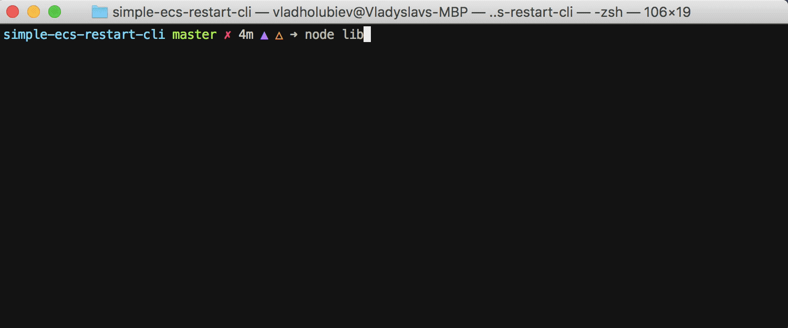

# Simple ECS restart CLI



## Features

This is a CLI for [simple-ecs-restart](https://github.com/vladgolubev/simple-ecs-restart)

It has serious trade-offs. This is considered for local development only.

* Red/green deployment. 1 -> 0 -> 1
* With the same task definition
* So it will pickup newest `latest` tag of docker image

If you want more features, such as green/blue deployment, setting env vars, different tags
then look at [ecs-deploy](https://github.com/fabfuel/ecs-deploy) project.

## Usage

It requires same env vars as `aws-sdk`

```bash
$ npm i -g simple-ecs-restart-cli
$ ser
```
